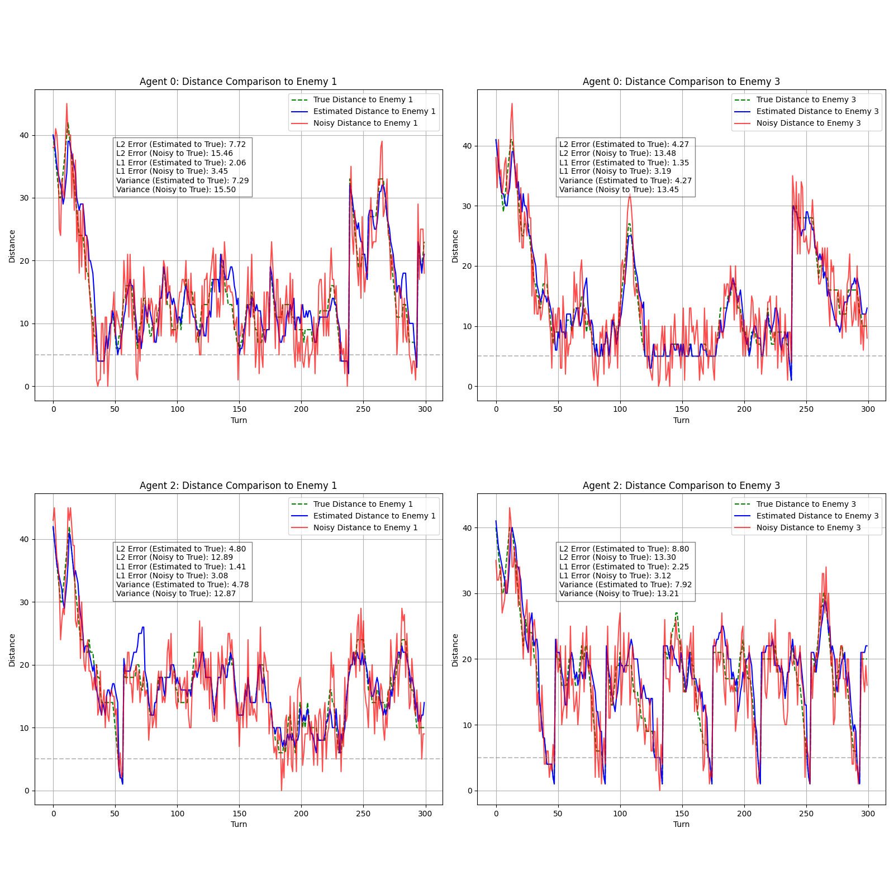

# A* is born

Our agents use a particle filter to make an accurate estimate of the enemies' positions and distances:

Furthermore, we have two different goal planners for our defensive and offensive agent. The goal planners use a finite state machine to determine which goal to set for each agent. And A*-Search with different heuristics decides which path to take to the set goal.

The behavior of the goal planners can be adapted by setting different hyperparameters. We determined a good set of parameters by running lots of games against different enemies and optimizing with regards to the points our team achieved.